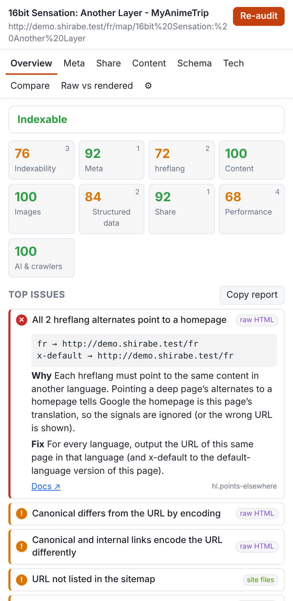
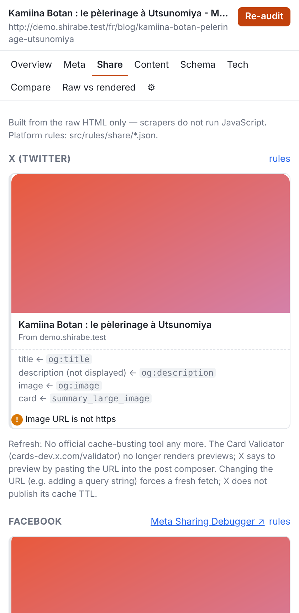
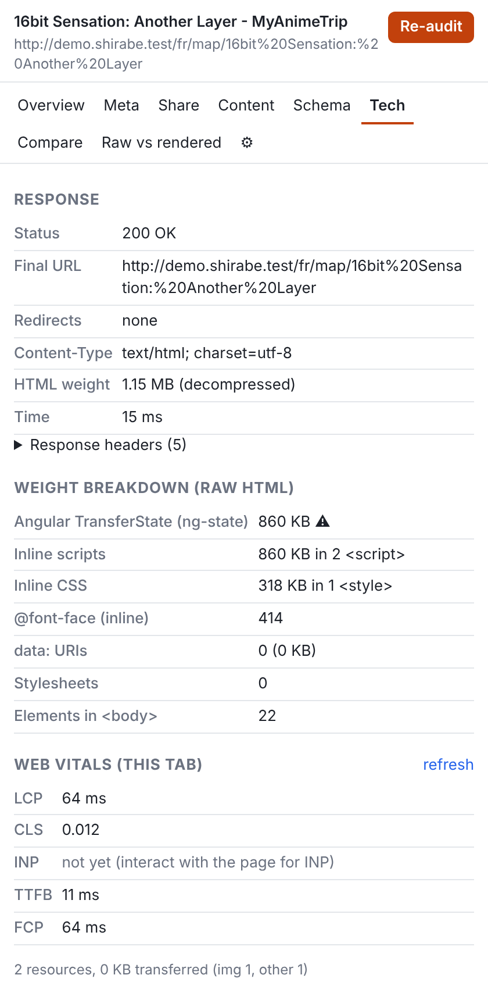
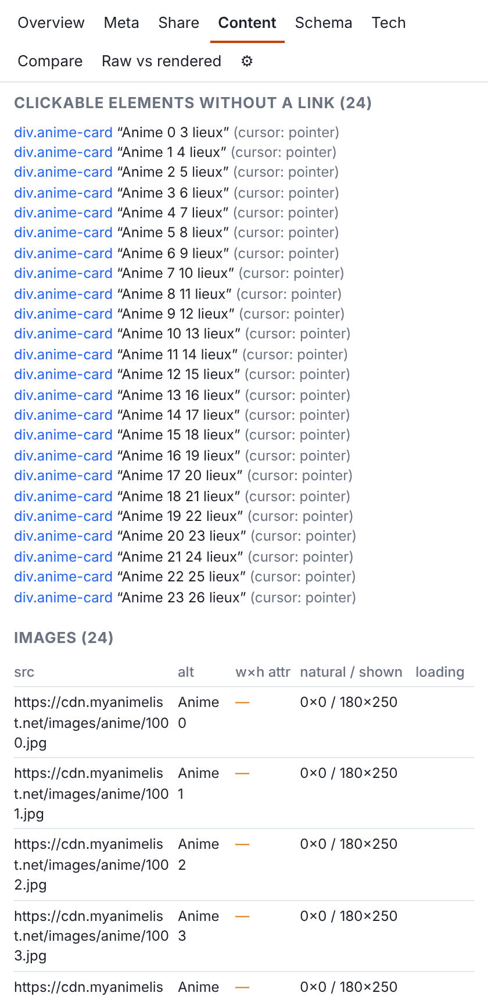
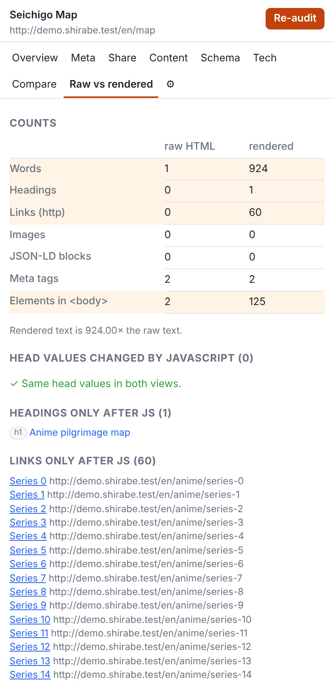
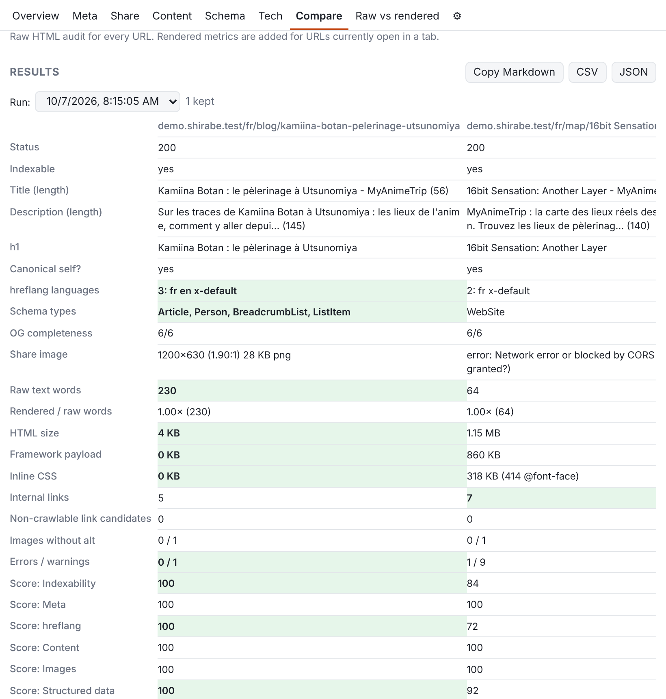

# Shirabe (調べ) — SEO & share-preview inspector

A personal Chrome extension (Manifest V3, side panel) that goes beyond
META SEO inspector:

- **Two views of every page, side by side**: the **raw HTML** the server sends
  (fetched by the extension without cookies, no JavaScript, which is what Googlebot
  sees first and all social scrapers see) and the **rendered DOM** of the tab.
  Every finding says which view it used, and the *Raw vs rendered* tab shows what
  only exists after JavaScript.
- **Actionable findings**: severity, the exact value found, why it matters, how to
  fix it, a docs link and *Show in page*.
- **Share previews** for X, Facebook, LinkedIn, Telegram, Discord, WhatsApp, Slack,
  iMessage and Google (desktop/mobile), built from platform rule files with
  their sources and verification date, plus share-image checks and crop previews.
- **Compare** a page against competitors (saved sets, history, Markdown/CSV/JSON export).
- **Fetch as bot** (Googlebot, Twitterbot, facebookexternalhit, TelegramBot,
  Discordbot, WhatsApp, Slackbot, LinkedInBot, iMessage) with a diff against a browser UA.
- Opt-in **probes**: soft 404, hreflang reciprocity, canonical target, broken links.
- robots.txt (search + AI crawlers), sitemap (gzip, indexes), llms.txt, Web Vitals.

Local only: no backend, no telemetry, no account.

## Screenshots

Side panel auditing the synthetic test pages (`pnpm screenshots` regenerates them).

| Overview | Share previews | Tech |
|---|---|---|
|  |  |  |
| **Content** | **Raw vs rendered** | |
|  |  | |

**Compare**



## Install

### From a release (no build needed)

1. Download `seo-shirabe-<version>-chrome.zip` from the latest
   [GitHub release](https://github.com/Raffaelbdl/seo-shirabe/releases/latest)
   and unzip it into a folder you keep (e.g. `~/Apps/shirabe`).
2. Open `chrome://extensions`, turn on *Developer mode*, and drag the unzipped
   folder onto the page (or *Load unpacked* → pick the folder).

To update: unzip the new release over the same folder and click ↻ on the
Shirabe card in `chrome://extensions`. Keeping the same folder keeps the same
extension ID, so settings and comparison sets are preserved.

### From source

Requires Node 22 and **pnpm** (the version is pinned in `package.json` →
`packageManager`). With Corepack, which ships with Node 22, you get that exact
version:

```sh
corepack enable       # or, without Corepack: npm install -g pnpm@10.28.0
pnpm install --frozen-lockfile
pnpm build            # → .output/chrome-mv3 (load it as above)
```

Use pnpm rather than npm. npm ignores `pnpm-lock.yaml` (transitive
dependencies would float), does not apply the 7-day `minimumReleaseAge`, runs
dependency install scripts by default, and `test:e2e` calls pnpm. See
[docs/supply-chain.md](docs/supply-chain.md).

### First use

Pin the extension, then click the **Shirabe toolbar icon on the page you want
to inspect**: the click opens the side panel and gives it temporary access to
that tab (Chrome hides tab addresses from extensions otherwise). Then press
*Allow <site>* once per site.

The first time you audit a site, Shirabe asks for access to that origin
(`optional_host_permissions`). *Settings (⚙) → Grant access to all sites*
does it once for every site (needed to check share images and links hosted
elsewhere without asking).

Web Vitals are collected by a small content script that is registered only for
granted origins, at page load: after granting a site, reload the tab once.

## Use

| Tab | What it shows |
|---|---|
| Overview | Indexability verdict + reasons, score per category (click to filter), top issues, all findings, *Copy report* (Markdown) |
| Meta | title / description with pixel-width estimates, canonical, robots meta + X-Robots-Tag, hreflang table, viewport, lang, charset, icons, theme-color (raw vs rendered when they differ) |
| Share | Preview card per platform with the tag each value came from, image checks, crop simulation, debugger links |
| Content | Headings outline, words raw vs rendered, links (internal/external/nofollow/not crawlable), clickable elements that are not links, images |
| Schema | JSON-LD (pretty-printed), microdata/RDFa, page-type guess, Rich Results Test / Schema.org validator links |
| Tech | Status, redirect chain, headers, weight breakdown (framework payloads, inline CSS, @font-face), Web Vitals, robots.txt / sitemap / llms.txt, fetch as bot, probes |
| Compare | Comparison sets, batch raw audits (2 at a time, polite), best value per row, history (last 10 runs), exports |
| Raw vs rendered | Counts, head values changed by JS, headings / links / text / JSON-LD only after JS |

Probes never run automatically. Audits run automatically on granted sites
(toggle in Settings).

## Develop

```sh
pnpm dev              # WXT dev mode with HMR
pnpm typecheck
pnpm test             # Vitest: rules, parsers, acceptance cases (Chromium via Playwright)
pnpm test:e2e         # builds with SHIRABE_E2E=1 and drives the real extension in Chromium
pnpm fixtures:fetch   # optional: fetch the real audited pages into tests/fixtures/real/
pnpm screenshots      # regenerate docs/screenshots/ from the built extension
```

Tests use the Chromium that ships with Playwright, or `/opt/pw-browsers/chromium`,
or `CHROMIUM_PATH`. The e2e build (`.output/chrome-mv3-e2e`) has a blanket
host permission so tests can run without the permission prompt; never load it
in your own browser.

## CI / releases

- `.github/workflows/ci.yml` runs on pushes to `main` and on pull requests
  targeting `main`: typecheck, unit tests, build and the e2e tests in Chromium.
- `.github/workflows/release.yml` publishes `v<package.json version>` as a
  GitHub release with `seo-shirabe-<version>-chrome.zip`, after the same checks.
  It runs automatically when a push to `main` changes `package.json`, and
  publishes only if that version has no release yet. It can also be started
  from *Actions → Release → Run workflow* on `main`.

**The version is never bumped automatically.** To release, bump `version` in
`package.json` by hand (e.g. `0.1.0` → `0.1.1`, following semver) in the
branch you merge to `main`. Merging without a bump publishes nothing, and an
existing release is never overwritten. The version is also what
`chrome://extensions` shows, so you can tell which build is installed.

Actions are pinned by commit SHA.

## Layout

```
src/
  entrypoints/
    background.ts         service worker: fetches, redirect capture, bot UA, probes, compare
    offscreen/            DOMParser for raw HTML (the service worker has none)
    vitals.content.ts     web-vitals collector (registered at runtime per granted origin)
    sidepanel/            React UI
  lib/
    extract/extractPage.ts  the extractor, shared by both views (self-contained, injected)
    rules/                  rule engine + catalogue (pure functions)
    share/                  platform rules loader, preview resolution, image checks
    collect.ts              raw audit, site files, probes (network injected → testable)
    compare.ts, diff.ts, report.ts, robots.ts, sitemap.ts, pixels.ts, url.ts, …
  rules/
    share/*.json            platform preview rules, with sources + lastVerified
    schema.json             Google rich-result required/recommended properties
    bots.json               User-Agents for "fetch as bot"
tests/
  fixtures/               synthetic pages reproducing the myanimetrip audit
  unit/                   Vitest
  e2e/                    Playwright with the extension loaded
```

See [docs/architecture.md](docs/architecture.md), [docs/rules.md](docs/rules.md)
and [docs/supply-chain.md](docs/supply-chain.md).
